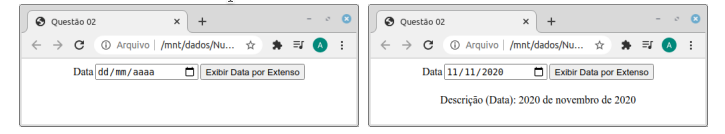

# data-extenso

Construa uma página semelhante àquela mostrada na figura abaixo (screenshot à esquerda) na qual haverá uma caixa de texto
para informe de data em formato “dd/mm/aaaa”; ao lado da caixa de texto, deverá ser exibido um botão para acionamento de
função JavaScript a ser desenvolvida e através da qual será exibida, logo abaixo, a mesma data, mas em formato extenso (vide,
a título de exemplo, screenshot em figura abaixo, à direita).

Observação: para a extração de partes de uma string, sugere-se aqui o uso da função split, cuja especificação pode ser
encontrada em https://developer.mozilla.org/pt-BR/docs/Web/JavaScript/Reference/Global_Objects/String/split.
